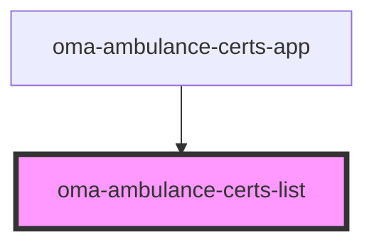

# oma-ambulance-certs-list

<!-- Auto Generated Below -->

## Properties

| Property          | Attribute          | Description | Type              | Default |
| ----------------- | ------------------ | ----------- | ----------------- | ------- |
| `apiBase`         | `api-base`         |             | `string`          | `""`    |
| `certificationId` | `certification-id` |             | `string`          | `""`    |
| `certifications`  | --                 |             | `Certification[]` | `[]`    |

## Events

| Event          | Description | Type                  |
| -------------- | ----------- | --------------------- |
| `action-event` |             | `CustomEvent<string>` |
| `error-event`  |             | `CustomEvent<string>` |

## Dependencies

### Used by

 - [oma-ambulance-certs-app](../oma-ambulance-certs-app)

### Graph

----------------------------------------------

*Built with [StencilJS](https://stenciljs.com/)*
