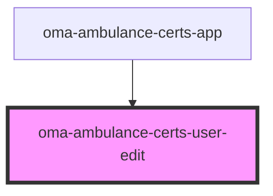

# oma-ambulance-certs-user-edit

<!-- Auto Generated Below -->

## Properties

| Property         | Attribute  | Description | Type              | Default                                                  |
| ---------------- | ---------- | ----------- | ----------------- | -------------------------------------------------------- |
| `apiBase`        | `api-base` |             | `string`          | `""`                                                     |
| `certifications` | --         |             | `Certification[]` | `[]`                                                     |
| `user`           | --         |             | `User`            | `{     id: "",     name: "",     certifications: []   }` |

## Events

| Event          | Description | Type                  |
| -------------- | ----------- | --------------------- |
| `action-event` |             | `CustomEvent<string>` |

## Dependencies

### Used by

 - [oma-ambulance-certs-app](../oma-ambulance-certs-app)

### Graph

----------------------------------------------

*Built with [StencilJS](https://stenciljs.com/)*
