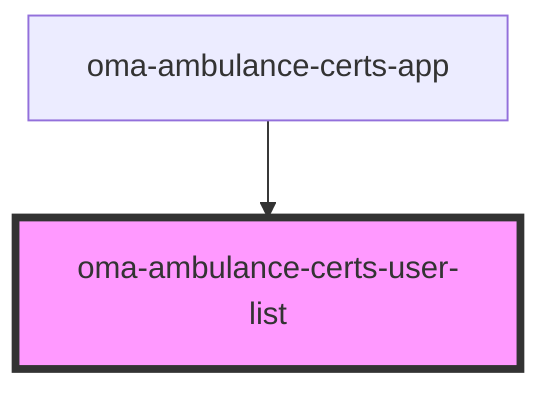

# oma-ambulance-certs-user-list

<!-- Auto Generated Below -->

## Properties

| Property         | Attribute  | Description | Type              | Default |
| ---------------- | ---------- | ----------- | ----------------- | ------- |
| `apiBase`        | `api-base` |             | `string`          | `""`    |
| `certifications` | --         |             | `Certification[]` | `[]`    |
| `userId`         | `user-id`  |             | `string`          | `""`    |
| `users`          | --         |             | `User[]`          | `[]`    |

## Events

| Event           | Description | Type                |
| --------------- | ----------- | ------------------- |
| `entry-clicked` |             | `CustomEvent<User>` |

## Dependencies

### Used by

 - [oma-ambulance-certs-app](../oma-ambulance-certs-app)

### Graph

----------------------------------------------

*Built with [StencilJS](https://stenciljs.com/)*
